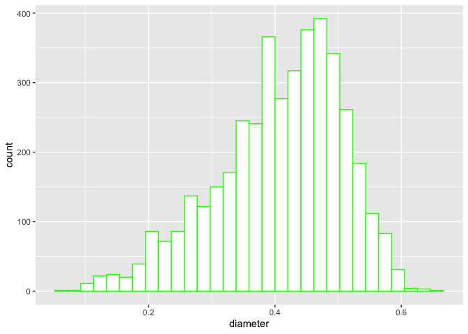
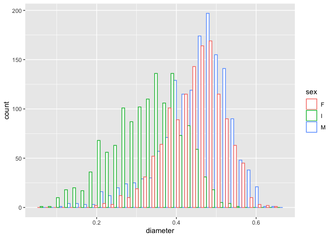
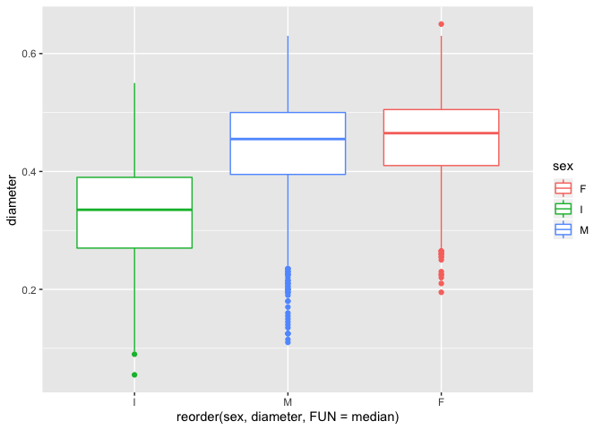
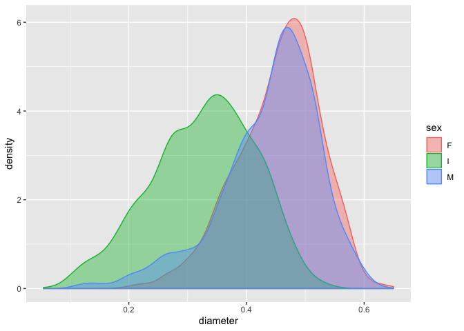
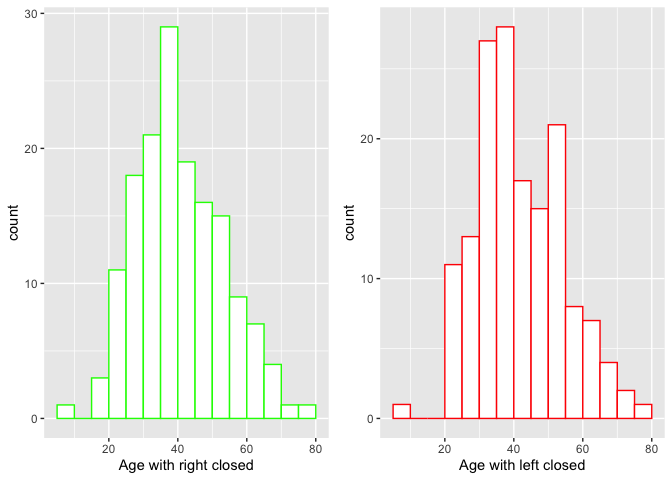
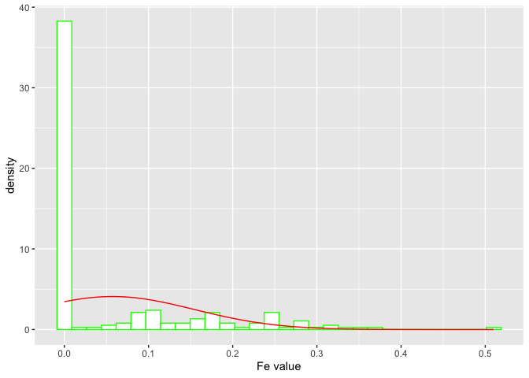
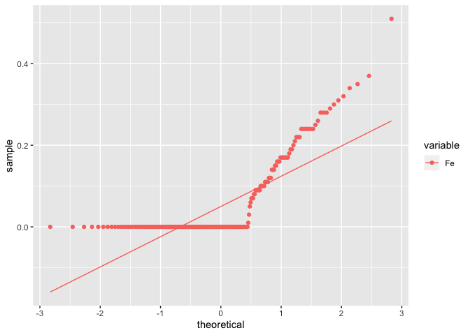

EDAV Fall 2019 Probem Set 1
================
null

Read *Graphical Data Analysis with R*, Ch. 3

Grading is based both on your graphs and verbal explanations. Follow all
best practices as discussed in class.

The datasets in this assignment are from the **ucidata** package which
can be installed from GitHub. You will first need to install the
`devtools` package if you don’t have it:

`install.packages(devtools)`

then,

`devtools::install_github(coatless/ucidata)`

``` r
library(ucidata)
library(ggplot2)
library(gridExtra)
library(dplyr)
```

### 1\. Abalone

\[18 points\]

Choose one of the numeric variables in the `abalone` dataset.

1)  Plot a histogram of the
variable.

<!-- end list -->

``` r
abalone %>% ggplot(., aes(x=diameter)) + geom_histogram(color="green", fill="white")
```

<!-- -->

2)  Plot histograms, faceted by `sex`, for the same
variable.

<!-- end list -->

``` r
abalone %>% ggplot(., aes(x=diameter, color=sex)) + geom_histogram(fill="white",  position="dodge")
```

<!-- -->

3)  Plot multiple boxplots, grouped by `sex` for the same variable. The
    boxplots should be ordered by decreasing median from left to
right.

<!-- end list -->

``` r
abalone %>% ggplot(., aes(x=reorder(sex,diameter, FUN=median), sex, y=diameter, color=sex)) + geom_boxplot()
```

<!-- -->

4)  Plot overlapping density curves of the same variable, one curve per
    factor level of `sex`, on a single set of axes. Each curve should be
    a different
color.

<!-- end list -->

``` r
abalone %>% ggplot(., aes(x=diameter, color=sex, fill=sex)) + geom_density(alpha=0.4)
```

<!-- -->

5)  Summarize the results of b), c) and d): what unique information,
    *specific to this variable*, is provided by each of the three
    graphical forms?

6)  Look at photos of an abalone. Do the measurements in the dataset
    seem right? What’s the issue?

### 2\. Hepatitis

\[6 points\]

1)  Draw two histograms of the age variable in the `hepatitis` dataset
    in the **ucidata** package, with binwidths of 5 years and `boundary
    = 0`, one right open and one right closed. How do they
compare?

<!-- end list -->

``` r
r <- hepatitis %>% ggplot(., aes(x=age)) + geom_histogram(color="green", fill="white", binwidth=5,  boundary=0, closed='right') + xlab("Age with right closed")
l <- hepatitis %>% ggplot(., aes(x=age)) + geom_histogram(color="red", fill="white", binwidth=5,  boundary=0, closed='left') + xlab("Age with left closed")
grid.arrange(r, l, ncol=2)  
```

<!-- -->

2)  Redraw the histogram using the parameters that you consider most
    appropriate for the data. Explain why you chose the parameters that
    you chose.

### 3\. Glass

``` r
library(tidyr)
library(dplyr)
df <- glass %>% select(2:10) %>% tidyr::gather(., key = "variable", value = "value")
```

\[18 points\]

1)  Use `tidyr::gather()` to convert the numeric columns in the `glass`
    dataset in the **ucidata** package to two columns: `variable` and
    `value`. The first few rows should be:

`variable value 1 RI 1.52101 2 RI 1.51761 3 RI 1.51618 4 RI 1.51766 5
RI 1.51742 6 RI 1.51596`

Use this form to plot histograms of all of the variables in one plot by
faceting on `variable`. What patterns do you
observe?

``` r
df %>% ggplot(., aes(x=value, color=variable)) + geom_histogram(fill="white", position="dodge")
```

<!-- -->

**For the remaining parts we will consider different methods to test for
normality.**

2)  Choose one of the variables with a unimodal shape histogram and draw
    a true normal curve on top on the histogram. How do the two compare?

<!-- end list -->

``` r
fe <- df[df[, "variable"] == "Fe",]
fe %>% ggplot(., aes(x=value))+ geom_histogram(aes(y =..density..),fill = "white", color="green") +
stat_function(fun = dnorm, args = list(mean = mean(fe$value), sd = sd(fe$value)), color="red") + xlab("Fe value")
```

<!-- -->

3)  Perform the Shapiro-Wilk test for normality of the variable using
    the `shapiro.test()` function. What do you conclude?

<!-- end list -->

``` r
shapiro.test(fe$value)
```

    ## 
    ##  Shapiro-Wilk normality test
    ## 
    ## data:  fe$value
    ## W = 0.6532, p-value < 2.2e-16

4)  Draw a quantile-quantile (QQ) plot of the variable. Does it appear
    to be normally distributed?

`None of the variable appears to be normally
distributed`

``` r
fe %>% ggplot(., aes(sample=value, color=variable)) + stat_qq() + stat_qq_line()
```

<!-- -->

5)  Use the **nullabor** package to create a lineup of histograms in
    which one panel is the real data and the others are fake data
    generated from a null hypothesis of normality. Can you pick out the
    real data? If so, how does the shape of its histogram differ from
    the others?

<!-- end list -->

``` r
library(nullabor)
```

6)  Show the lineup to someone else, not in our class (anyone, no
    background knowledge required). Ask them which plot looks the most
    different from the others. Did they choose the real data?

7)  Briefly summarize your investigations. Did all of the methods
    produce the same result?

### 4\. Forest Fires

\[8 points\]

Using the `forest_fires` dataset in the **ucidata** package, analyze the
burned area of the forest by month. Use whatever graphical forms you
deem most appropriate. Describe important trends.
